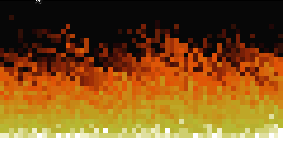

# Doom Fire

Recriação do efeito de fogo do DOOM (PlayStation, 1995) em JavaScript puro. Sem
biblioteca, sem build, sem dependência: é só abrir o `index.html` no navegador.

    

## Como funciona

O fogo é uma grade de 120x60 guardada em um array de uma dimensão só
(`firePixelsArray`). Cada posição carrega um número de 0 a 36, que é a intensidade
daquele ponto, e esse número vira cor na paleta de 37 tons (`fireColorsPalette`),
que vai do quase preto ao branco.

O ciclo roda a cada 50ms e tem quatro partes:

1. **Fonte.** A última linha da grade começa em 36, o branco da paleta, e nunca
   muda. É a brasa que alimenta todo o resto.
2. **Propagação.** Cada pixel copia a intensidade do pixel logo abaixo e desconta
   um valor aleatório, o `decay`. Linha após linha a chama esfria, até zerar.
3. **Vento.** O valor não é gravado na mesma coluna, e sim algumas colunas à
   esquerda (`wind`). Esse desvio aleatório é o que faz a chama vergar e tremer.
4. **Render.** A grade vira uma `<table>`, uma `<td>` por pixel, com a intensidade
   traduzida para `background-color`.

O `decay` e o `wind` são dois valores separados de propósito. Um controla a altura
da chama, o outro o balanço lateral, e assim dá para calibrar um sem estragar o
outro.

## Ajustes

Tudo o que muda o resultado está em duas variáveis por arquivo:

| Onde | Variável | Valor | O que controla |
|---|---|---|---|
| `fogo.js` | `fireWidth` / `fireHeight` | 120 / 60 | tamanho da grade |
| `fogo.js` | `decay` | `random() * 2.5` | altura da chama: menor sobe mais |
| `fogo.js` | `wind` | `random() * 2.5` | balanço lateral: maior verga mais |
| `fogo.js` | `setInterval` | 50 | milissegundos entre quadros |
| `style.css` | `.pixel` | 8px | tamanho de cada pixel na tela |

Vale notar que a altura da chama é fixa em número de linhas, não em porcentagem
da tela. Dobrar `fireHeight` sem mexer no `decay` faz o fogo parecer mais baixo.

## Modo debug

Trocar `const debug = false` por `true` dentro de `fireRender()` troca as cores
pelo índice e pela intensidade de cada pixel. É a forma mais rápida de enxergar o
array por trás da imagem e entender a propagação acontecendo.

## Limitação conhecida

O render remonta a tabela HTML inteira a cada quadro, via `innerHTML`. Nas 7.200
células atuais roda liso, mas o custo cresce junto com a grade: em 240x120 já
engasga. Resolver isso passa por trocar a `<table>` por um `<canvas>`.

## Aprendizado

Fiz esse projeto como exercício para aprender JavaScript, seguindo o tutorial do
[Filipe Deschamps](https://github.com/filipedeschamps) sobre o
[fogo do DOOM](https://youtu.be/fxm8cadCqbs).

Até então eu só tinha programado em C, e foi aqui que caiu a ficha de como
funcionam funções, variáveis, arrays e objetos em JavaScript. Os vídeos do Filipe
ensinam muito além da linguagem, ensinam a pensar como programador. Recomendo para
qualquer pessoa que esteja começando.
